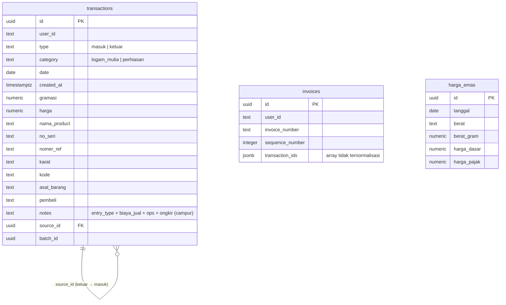
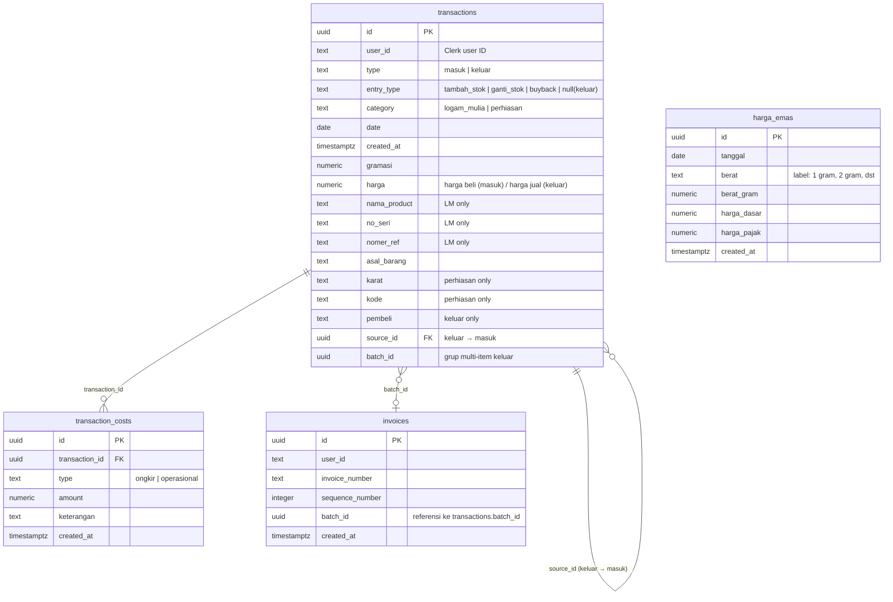

# Database ERD — Pohon Emas App

## Current Schema (As-Is)

Masalah skema saat ini:
- Kolom `notes` menyimpan banyak data terstruktur (anti-pattern): `entry_type`, `biaya_jual`, `ops`, `ongkir`
- `entry_type` tidak punya kolom sendiri
- Biaya operasional keluar embedded di `notes` (tidak ternormalisasi)
- `invoices.transaction_ids` kemungkinan array (tidak ternormalisasi)



---

## Proposed Schema (Clean)

Perbaikan:
1. `entry_type` jadi kolom sendiri dengan enum
2. Biaya operasional dipisah ke tabel `transaction_costs`
3. `invoices` referensi via `batch_id` (bukan array)
4. Kolom LM dan perhiasan tetap di `transactions` (nullable sesuai kategori)



---

## Perbandingan Kolom

### `transactions` — notes (lama) → kolom terpisah (baru)

| Data di `notes` lama | Solusi baru |
|---|---|
| `entry_type:stok_awal` | `entry_type = 'tambah_stok'` |
| `entry_type:buyback` | `entry_type = 'buyback'` |
| *(null = ganti stok)* | `entry_type = 'ganti_stok'` |
| `ops:50000:komisi` | tabel `transaction_costs` |
| `ongkir:10000` | tabel `transaction_costs` |
| `biaya_jual:50000` *(legacy)* | tabel `transaction_costs` |

### `invoices` — transaction_ids (lama) → batch_id (baru)

| Lama | Baru |
|---|---|
| `transaction_ids: [uuid, uuid, ...]` | `batch_id: uuid` (referensi ke `transactions.batch_id`) |

---

## Migration Notes

> ⚠️ Migrasi perlu dilakukan bertahap — aplikasi harus tetap berjalan selama proses.

### Step 1: Tambah kolom `entry_type` di `transactions`
```sql
ALTER TABLE transactions
ADD COLUMN entry_type TEXT
CHECK (entry_type IN ('tambah_stok', 'ganti_stok', 'buyback'));

-- Backfill dari notes
UPDATE transactions SET entry_type = 'tambah_stok'
WHERE type = 'masuk' AND notes LIKE '%entry_type:stok_awal%';

UPDATE transactions SET entry_type = 'buyback'
WHERE type = 'masuk' AND notes LIKE '%entry_type:buyback%';

UPDATE transactions SET entry_type = 'ganti_stok'
WHERE type = 'masuk'
AND (notes IS NULL OR notes NOT LIKE '%entry_type:%');
```

### Step 2: Buat tabel `transaction_costs`
```sql
CREATE TABLE transaction_costs (
  id UUID PRIMARY KEY DEFAULT gen_random_uuid(),
  transaction_id UUID NOT NULL REFERENCES transactions(id) ON DELETE CASCADE,
  type TEXT NOT NULL CHECK (type IN ('ongkir', 'operasional')),
  amount NUMERIC NOT NULL,
  keterangan TEXT,
  created_at TIMESTAMPTZ DEFAULT NOW()
);

-- Backfill dari notes (perlu script Node.js untuk parse regex)
-- Lihat scripts/migrate-notes-to-costs.js
```

### Step 3: Update `invoices`
```sql
ALTER TABLE invoices ADD COLUMN batch_id UUID;

-- Backfill: ambil batch_id dari transactions berdasarkan transaction_ids
-- Perlu script karena transaction_ids adalah array
```

### Step 4: Hapus kolom lama (setelah kode diupdate)
```sql
-- Setelah semua kode sudah tidak pakai notes untuk entry_type
ALTER TABLE transactions DROP COLUMN notes; -- atau bersihkan isinya
```
